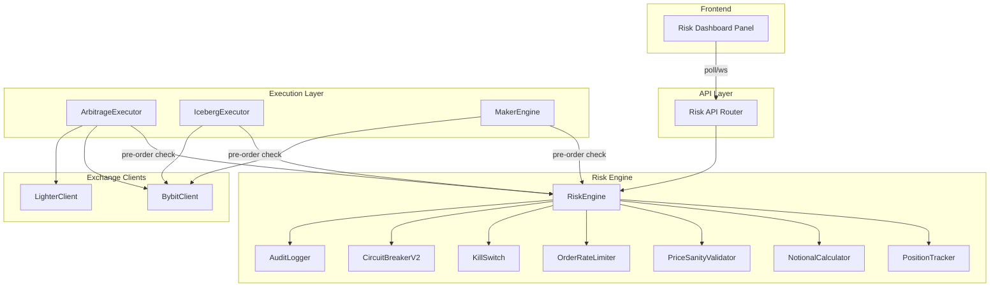
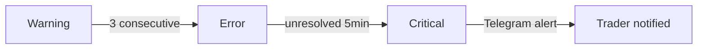

# Design Document: Risk Framework

## Overview

The Risk Framework introduces a centralized safety layer that intercepts all order submissions in the Alphast spread-dashboard execution pipeline. It enforces configurable risk gates — dry-run mode, position limits, notional exposure caps, order rate limiting, price sanity validation, kill switch, and circuit breaker cooldown — before any order reaches an exchange. Every risk decision is persisted to an audit trail, exposed via a REST API, and visualized in a frontend dashboard panel.

The framework integrates as middleware between the existing execution services (`ArbitrageExecutor`, `IcebergExecutor`, `MakerEngine`) and the exchange clients (`BybitClient`, `LighterClient`). It wraps the current `CircuitBreaker` singleton with enhanced cooldown logic and adds new components for position tracking, notional computation, and price validation.

### Design Goals

- **Safety-first defaults**: Dry-run mode ON at startup; kill switch state persisted across restarts
- **Non-blocking audit**: Audit writes must not block the execution hot path (<10ms)
- **Hot-reloadable config**: All risk parameters updatable via API without restart
- **Minimal coupling**: Risk engine operates as a gate; existing execution logic remains unchanged
- **Observable**: Full state exposed via API and WebSocket for dashboard consumption

## Architecture



### Integration Points

1. **Execution interceptor**: Each executor calls `risk_engine.evaluate_order(order)` before submitting to exchange clients. Returns `Approve | Reject | Simulate` decision.
2. **Position updates**: After each fill confirmation, executors call `position_tracker.update_position(fill)` to maintain real-time position state.
3. **Price feed**: `PriceSanityValidator` reads from the existing `spread_engine` in-memory tick cache (`get_latest_tick`).
4. **Kill switch triggers**: The poll loop's existing `_check_feed_staleness` and `circuit_breaker.record_execution_failure` are wired into the new `KillSwitch` auto-trigger logic.
5. **API layer**: New `risk_routes.py` router mounted alongside existing routers in `main.py`.
6. **Frontend**: New `RiskPanel` component added to the dashboard, polling `/api/v1/risk/status`.

## Components and Interfaces

### RiskEngine

The central orchestrator that evaluates all risk checks in sequence.

```python
class RiskDecision(Enum):
    APPROVE = "approve"
    REJECT = "reject"
    SIMULATE = "simulate"  # dry-run mode

@dataclass
class RiskEvaluation:
    decision: RiskDecision
    reason: str
    order: OrderRequest
    risk_snapshot: RiskStateSnapshot
    timestamp_ms: int

class RiskEngine:
    def __init__(self, config: RiskConfig):
        self.config = config
        self.dry_run: bool = True  # Always starts ON
        self.kill_switch: KillSwitch
        self.circuit_breaker: CircuitBreakerV2
        self.position_tracker: PositionTracker
        self.notional_calculator: NotionalCalculator
        self.price_validator: PriceSanityValidator
        self.rate_limiter: OrderRateLimiter
        self.audit_logger: AuditLogger

    async def evaluate_order(self, order: OrderRequest) -> RiskEvaluation:
        """
        Evaluate an order against all risk gates in priority order:
        1. Kill switch check
        2. Circuit breaker cooldown check
        3. Dry-run mode check (simulate if ON)
        4. Price sanity validation
        5. Position limit check
        6. Notional exposure check
        7. Rate limit check (may queue)
        Returns decision with full context.
        """
        ...

    async def set_dry_run(self, enabled: bool, confirm_live: bool = False) -> bool:
        """Toggle dry-run mode. Requires confirm_live=True to disable."""
        ...

    def get_risk_state(self) -> RiskStateSnapshot:
        """Return current state of all risk components."""
        ...

    async def update_config(self, updates: dict) -> None:
        """Hot-reload risk parameters without restart."""
        ...
```

### KillSwitch

Persistent kill switch with manual and automatic triggers.

```python
class KillSwitch:
    def __init__(self, db_path: str):
        self.active: bool = False
        self.activation_reason: str = ""
        self.activation_ts: float = 0
        self._db_path = db_path  # SQLite for persistence

    async def activate(self, reason: str) -> None:
        """Halt all trading, cancel pending orders, persist state."""
        ...

    async def reset(self, confirm_reset: bool = False) -> bool:
        """Deactivate kill switch. Requires explicit confirmation."""
        ...

    async def restore_state(self) -> None:
        """Load persisted state on startup."""
        ...

    def check_auto_triggers(
        self,
        rolling_loss_24h: float,
        consecutive_failures: int,
        feed_stale: bool,
        spread_inverted: bool,
    ) -> str | None:
        """Check automatic trigger conditions. Returns reason if triggered."""
        ...
```

### CircuitBreakerV2

Enhanced circuit breaker extending the existing `CircuitBreaker` with cooldown.

```python
class CircuitBreakerV2:
    def __init__(self, config: CircuitBreakerConfig):
        self.tripped: bool = False
        self.cooldown_active: bool = False
        self.cooldown_end_ts: float = 0
        self.config = config  # cooldown_minutes, max_failures, etc.

    def trip(self, reason: str) -> bool:
        """Trip breaker and start cooldown timer."""
        ...

    def check_cooldown(self) -> tuple[bool, float]:
        """Returns (is_blocked, remaining_seconds)."""
        ...

    async def override_cooldown(self, confirm_override: bool = False) -> bool:
        """Allow early reset with explicit confirmation."""
        ...

    def on_cooldown_expired(self) -> None:
        """Transition to ready state when cooldown completes."""
        ...
```

### PositionTracker

Tracks net signed positions per symbol across all exchanges.

```python
class PositionTracker:
    def __init__(self):
        self._positions: dict[str, float] = {}  # symbol -> net signed qty

    def update_position(self, symbol: str, side: str, qty: float, exchange: str) -> None:
        """Update position after fill. Buys positive, sells negative."""
        ...

    def get_net_position(self, symbol: str) -> float:
        """Get net signed position for a symbol (combined across exchanges)."""
        ...

    def get_all_positions(self) -> dict[str, float]:
        """Get all tracked positions."""
        ...

    def would_exceed_limit(
        self, symbol: str, side: str, qty: float, limit: float, reference_mid: float
    ) -> bool:
        """Check if order would cause position to exceed limit in BTC equivalent."""
        ...

    def would_reduce_position(self, symbol: str, side: str, qty: float) -> bool:
        """Check if order reduces absolute net position (allowed when over limit)."""
        ...
```

### NotionalCalculator

Computes total USD notional exposure across all positions.

```python
class NotionalCalculator:
    def __init__(self, position_tracker: PositionTracker):
        self._position_tracker = position_tracker

    def compute_total_exposure(self, reference_mids: dict[str, float]) -> float:
        """Sum of |position_size × reference_mid| for all symbols."""
        ...

    def would_exceed_cap(
        self,
        symbol: str,
        side: str,
        qty: float,
        reference_mid: float,
        cap: float,
    ) -> bool:
        """Check if order would push total notional above cap."""
        ...
```

### PriceSanityValidator

Validates order prices against reference mid with staleness checks.

```python
@dataclass
class PriceValidationResult:
    valid: bool
    reason: str = ""
    order_price: float = 0
    reference_mid: float = 0
    deviation_pct: float = 0

class PriceSanityValidator:
    def __init__(self, band_pct: float = 0.5, max_age_s: float = 2.0):
        self.band_pct = band_pct
        self.max_age_s = max_age_s

    def validate(
        self, order_price: float, symbol: str, exchange: str
    ) -> PriceValidationResult:
        """
        Validate order price against reference mid.
        Rejects if: deviation > band_pct, data stale > max_age_s, or no orderbook.
        """
        ...
```

### OrderRateLimiter

Per-exchange sliding window rate limiter with queue and timeout.

```python
class OrderRateLimiter:
    def __init__(self, config: RateLimitConfig):
        self._windows: dict[str, deque[float]] = {}  # exchange -> timestamps
        self._queues: dict[str, asyncio.Queue] = {}
        self.config = config  # max_per_minute, queue_timeout_s

    async def acquire(self, exchange: str) -> bool:
        """
        Attempt to acquire a rate slot. Queues if at limit.
        Returns False if queue timeout (30s) exceeded.
        """
        ...

    def get_rate_status(self, exchange: str) -> dict:
        """Current count and remaining capacity for an exchange."""
        ...

    async def discard_all(self) -> list[dict]:
        """Discard all queued orders (called on kill switch). Returns discarded."""
        ...
```

### AuditLogger

Non-blocking persistent audit trail with fallback buffering.

```python
class AuditLogger:
    def __init__(self, db_path: str, retention_days: int = 90):
        self._db_path = db_path
        self._retention_days = retention_days
        self._buffer_path = "./data/audit_buffer.jsonl"
        self._write_queue: asyncio.Queue = asyncio.Queue()

    async def start(self) -> None:
        """Start background writer task."""
        ...

    async def log_decision(self, evaluation: RiskEvaluation) -> None:
        """Queue a risk decision for async persistence (<10ms)."""
        ...

    async def log_event(self, event_type: str, details: dict) -> None:
        """Log configuration changes, kill switch events, etc."""
        ...

    async def query(
        self,
        time_from: float | None = None,
        time_to: float | None = None,
        symbol: str | None = None,
        decision_type: str | None = None,
        status: str | None = None,
        page: int = 1,
        page_size: int = 50,
    ) -> dict:
        """Query audit records with filtering and pagination."""
        ...

    async def _flush_buffer(self) -> None:
        """Replay buffered records to SQLite when DB is available."""
        ...

    async def _daily_purge(self) -> None:
        """Remove records older than retention_days."""
        ...
```

### Risk API Router

```python
# FastAPI router: /api/v1/risk/
router = APIRouter(prefix="/api/v1/risk", tags=["risk"])

# GET /status — full risk state snapshot
# POST /kill-switch — activate or reset
# PUT /config — update risk parameters
# GET /audit — paginated audit trail
# POST /dry-run — toggle dry-run mode
```

### Risk Dashboard Component (Frontend)

```typescript
// React component: RiskPanel
// - Polls GET /api/v1/risk/status every 2s
// - Displays: dry-run toggle, positions, notional, rates, kill switch, circuit breaker
// - Confirmation dialogs for destructive actions
// - Color-coded audit trail (green/red/yellow)
// - Alert banner on auto kill switch activation
// - Connectivity warning after 3 failed refreshes
```

## Data Models

### OrderRequest

```python
@dataclass
class OrderRequest:
    symbol: str
    side: str          # "Buy" | "Sell"
    qty: float
    price: float
    exchange: str      # "bybit" | "lighter"
    order_type: str    # "Limit" | "Market"
    source: str        # "arb" | "iceberg" | "maker" | "manual"
    timestamp_ms: int = field(default_factory=lambda: int(time.time() * 1000))
```

### RiskConfig

```python
@dataclass
class RiskConfig:
    # Dry-run
    dry_run_enabled: bool = True

    # Position limits (BTC equivalent)
    max_position_per_symbol: float = 0.1  # range: 0.001 to 100
    position_limits_override: dict[str, float] = field(default_factory=dict)

    # Notional exposure
    max_notional_exposure_usd: float = 10_000.0  # range: 100 to 10_000_000

    # Rate limiting
    max_orders_per_minute_per_exchange: int = 10
    rate_limit_queue_timeout_s: float = 30.0

    # Price sanity
    price_band_pct: float = 0.5  # range: 0.01 to 50.0

    # Kill switch
    kill_switch_loss_threshold_usd: float = 500.0
    kill_switch_consecutive_failures: int = 3
    kill_switch_feed_stale_s: float = 30.0
    kill_switch_spread_inversion_pct: float = 2.0
    kill_switch_spread_inversion_duration_s: float = 1.0

    # Circuit breaker cooldown
    cooldown_minutes: float = 5.0  # range: 1 to 60

    # Audit
    audit_retention_days: int = 90
```

### RiskStateSnapshot

```python
@dataclass
class RiskStateSnapshot:
    dry_run_mode: bool
    kill_switch_active: bool
    kill_switch_reason: str
    circuit_breaker_tripped: bool
    cooldown_active: bool
    cooldown_remaining_s: float
    positions: dict[str, float]           # symbol -> net qty
    notional_exposure_usd: float
    notional_cap_usd: float
    order_rates: dict[str, dict]          # exchange -> {count, remaining}
    timestamp_ms: int
```

### Audit Record (SQLite Schema)

```sql
CREATE TABLE IF NOT EXISTS risk_audit (
    id INTEGER PRIMARY KEY AUTOINCREMENT,
    timestamp_ms INTEGER NOT NULL,
    decision_type TEXT NOT NULL,          -- 'approve', 'reject', 'simulate'
    symbol TEXT,
    side TEXT,
    qty REAL,
    price REAL,
    exchange TEXT,
    order_type TEXT,
    source TEXT,
    reason TEXT,
    -- Risk state at decision time
    dry_run_mode INTEGER,
    kill_switch_active INTEGER,
    circuit_breaker_tripped INTEGER,
    cooldown_active INTEGER,
    positions_json TEXT,                  -- JSON: {symbol: qty}
    notional_exposure_usd REAL,
    order_rates_json TEXT,               -- JSON: {exchange: count}
    created_at TEXT DEFAULT (datetime('now'))
);

CREATE INDEX idx_risk_audit_ts ON risk_audit(timestamp_ms);
CREATE INDEX idx_risk_audit_symbol ON risk_audit(symbol);
CREATE INDEX idx_risk_audit_decision ON risk_audit(decision_type);

-- Kill switch persistence
CREATE TABLE IF NOT EXISTS risk_kill_switch_state (
    id INTEGER PRIMARY KEY CHECK (id = 1),
    active INTEGER NOT NULL DEFAULT 0,
    reason TEXT DEFAULT '',
    activation_ts REAL DEFAULT 0
);
```

## Correctness Properties

*A property is a characteristic or behavior that should hold true across all valid executions of a system — essentially, a formal statement about what the system should do. Properties serve as the bridge between human-readable specifications and machine-verifiable correctness guarantees.*

### Property 1: Dry-run mode simulates all orders

*For any* valid `OrderRequest` submitted while `dry_run_mode` is `True`, the `RiskEngine.evaluate_order` SHALL return a decision of `SIMULATE`, the audit record SHALL contain a `"dry_run"` status flag, and no exchange submission SHALL occur.

**Validates: Requirements 1.2, 1.3**

### Property 2: Position limit enforcement

*For any* symbol with a configured maximum position limit `L`, and *for any* incoming order with signed quantity `q` (positive for Buy, negative for Sell), the `RiskEngine` SHALL reject the order if and only if `|current_net_position + q| > L` (in BTC equivalent using `Reference_Mid`), where `current_net_position` is the algebraic sum of all prior fills for that symbol.

**Validates: Requirements 2.1, 2.2, 2.6**

### Property 3: Position tracking correctness

*For any* sequence of fills `[(symbol, side, qty, exchange), ...]`, the `PositionTracker.get_net_position(symbol)` SHALL equal the algebraic sum of signed quantities (Buy = +qty, Sell = -qty) for that symbol across all exchanges.

**Validates: Requirements 2.3**

### Property 4: Over-limit position reduction allowed

*For any* symbol where `|current_net_position| > configured_limit`, the `RiskEngine` SHALL approve orders that would decrease `|net_position|` and reject orders that would increase `|net_position|`.

**Validates: Requirements 2.5**

### Property 5: Notional exposure cap enforcement

*For any* set of positions across symbols and *for any* incoming order, the `RiskEngine` SHALL reject the order if and only if the projected total notional exposure (computed as `sum(|position_i × reference_mid_i|)` for all symbols after applying the order) exceeds the configured cap.

**Validates: Requirements 3.1, 3.2, 3.3, 3.6**

### Property 6: Over-cap notional reduction allowed

*For any* state where total notional exposure exceeds the configured cap, the `RiskEngine` SHALL approve orders that would decrease the absolute position size for the order's symbol and reject orders that would increase total notional exposure.

**Validates: Requirements 3.5**

### Property 7: Configuration parameter range validation

*For any* risk parameter update request via the Risk_API, if the requested value falls outside the parameter's valid range (position limit: 0.001–100 BTC, notional cap: $100–$10,000,000, price band: 0.01%–50.0%, cooldown: 1–60 minutes), the API SHALL reject the request with a 400 status. If the value is within range, the API SHALL accept and apply it.

**Validates: Requirements 3.4, 3.7, 5.7, 5.8, 7.7, 9.7**

### Property 8: Price sanity validation

*For any* order with price `p` and *for any* valid (non-stale, non-empty) orderbook with `Reference_Mid = (best_bid + best_ask) / 2`, the `PriceSanityValidator` SHALL reject the order if and only if `|p - Reference_Mid| / Reference_Mid × 100 > configured_band_pct`, and the rejection response SHALL contain the order price, Reference_Mid, and computed deviation percentage.

**Validates: Requirements 5.1, 5.3, 5.4**

### Property 9: Kill switch blocks all orders

*For any* valid `OrderRequest` submitted while the `KillSwitch` is active, the `RiskEngine.evaluate_order` SHALL return a `REJECT` decision with reason `"kill switch active"`.

**Validates: Requirements 6.7**

### Property 10: Consecutive failure auto-trigger

*For any* sequence of order execution results, if 3 or more consecutive results are failures (and no success intervenes), the `KillSwitch` SHALL activate. If a success occurs before reaching 3 consecutive failures, the counter SHALL reset and the `KillSwitch` SHALL remain inactive.

**Validates: Requirements 6.3**

### Property 11: Loss threshold auto-trigger

*For any* sequence of realized trade losses within a rolling 24-hour window, if the sum of losses exceeds the configured threshold, the `KillSwitch` SHALL activate automatically.

**Validates: Requirements 6.2**

### Property 12: Confirmation required for dangerous actions

*For any* API request to disable dry-run mode, reset the kill switch, or override circuit breaker cooldown, the system SHALL reject the request unless the corresponding confirmation parameter (`confirm_live=true`, `confirm_reset=true`, or `confirm_override=true`) is explicitly provided.

**Validates: Requirements 1.4, 6.8, 7.5**

### Property 13: Cooldown blocks then allows

*For any* order submitted during an active cooldown period (time since circuit breaker trip < configured cooldown duration), the `RiskEngine` SHALL reject with `"cooldown active"` reason. *For any* order submitted after the cooldown period has fully elapsed, the cooldown check SHALL pass.

**Validates: Requirements 7.1, 7.2, 7.3**

### Property 14: Re-trip resets cooldown timer

*For any* circuit breaker that is tripped again while a cooldown period is already active, the cooldown end timestamp SHALL be reset to `now + full_configured_duration`, regardless of how much time had already elapsed.

**Validates: Requirements 7.6**

### Property 15: Sliding window rate limiting

*For any* exchange and *for any* sequence of order timestamps, the `OrderRateLimiter` SHALL count only orders whose timestamps fall within the most recent 60-second window. If the count equals or exceeds the configured maximum, subsequent orders SHALL be queued rather than immediately submitted.

**Validates: Requirements 4.1, 4.2, 4.4**

### Property 16: Kill switch discards all queued orders

*For any* set of orders currently queued in the `OrderRateLimiter` across all exchanges, when the `KillSwitch` activates, all queued orders SHALL be discarded and each discarded order SHALL be logged.

**Validates: Requirements 4.7**

### Property 17: Audit record round-trip persistence

*For any* `RiskEvaluation` (containing decision type, order details, and risk state snapshot), after the `AuditLogger` persists the record, querying the audit table by timestamp SHALL return a record with all original fields preserved (decision_type, symbol, side, qty, price, exchange, order_type, reason, positions, notional_exposure, order_rates, kill_switch_active, circuit_breaker_tripped, dry_run_mode).

**Validates: Requirements 8.1, 8.2**

### Property 18: Audit query filtering correctness

*For any* set of audit records and *for any* query filter combination (time_range, symbol, decision_type, status), the returned results SHALL contain only records matching ALL specified filters, and the result count SHALL not exceed the requested page_size.

**Validates: Requirements 8.4, 9.5**

### Property 19: Audit retention purge

*For any* set of audit records with varying timestamps, after the daily purge runs with a configured retention of `N` days, no records with `timestamp_ms < (now - N days)` SHALL remain in the database.

**Validates: Requirements 8.5**

### Property 20: API authentication enforcement

*For any* write request (POST, PUT) to the Risk_API, if the `X-API-Key` header is missing or contains a value that does not match the configured API key, the request SHALL be rejected with a 401 status.

**Validates: Requirements 9.4**

## Error Handling

### Risk Engine Errors

| Scenario | Behavior |
|----------|----------|
| Exchange client unreachable during order cancel (kill switch) | Retry up to 3 times with 500ms backoff; log failure; alert via Telegram |
| Audit DB write failure | Buffer to `./data/audit_buffer.jsonl`; emit warning; continue execution |
| Position tracker receives invalid fill data | Log error; skip update; do not corrupt state |
| Reference mid unavailable (no orderbook) | Reject order with "unavailable reference price" reason |
| Reference mid stale (>2s old) | Reject order with "stale reference price" reason |
| Rate limiter queue timeout (>30s) | Reject order with "rate-limit timeout" reason; remove from queue |
| Config update with invalid JSON | Return 400 with validation error details |
| Kill switch state DB corrupted on startup | Default to kill switch ACTIVE (fail-safe); log critical alert |

### Graceful Degradation

- If the audit logger is completely unavailable (DB + buffer file both fail), the risk engine continues operating but emits a critical Telegram alert
- If position data is stale (portfolio fetch timeout), the risk engine uses last-known positions and logs a warning
- If the kill switch persistence layer fails, the kill switch defaults to ACTIVE on restart (fail-safe)

### Alert Escalation



- **Warning**: Rate limit delays >5s, audit buffer active, stale position data
- **Error**: Kill switch auto-triggered, consecutive execution failures
- **Critical**: Audit system fully unavailable, kill switch persistence failure

## Testing Strategy

### Property-Based Testing

The risk framework is well-suited for property-based testing because:
- Core risk checks are pure functions with clear input/output behavior (position limits, notional caps, price validation)
- Universal properties hold across a wide input space (any order, any position state, any price)
- The input space is large (arbitrary order sizes, prices, position combinations)

**Library**: [Hypothesis](https://hypothesis.readthedocs.io/) (Python PBT library)

**Configuration**:
- Minimum 100 iterations per property test
- Each test tagged with: `# Feature: risk-framework, Property {N}: {title}`
- Custom strategies for generating `OrderRequest`, `RiskConfig`, position states, and price data

**Property tests cover**: Properties 1–20 as defined in the Correctness Properties section above.

### Unit Tests (Example-Based)

Unit tests complement property tests for specific scenarios:

- **Dry-run toggle**: Verify transition events are logged (Req 1.5)
- **Config hot-reload**: Update limit, verify next order uses new value (Req 2.4)
- **Rate limit warning**: Verify audit warning logged when delay >5s (Req 4.5)
- **Kill switch activation audit**: Verify full context in audit record (Req 6.6)
- **Circuit breaker API response**: Verify state and remaining seconds in response (Req 7.4)
- **Risk status endpoint**: Verify all fields present in response (Req 9.1)
- **Config change audit**: Verify old/new values logged (Req 9.6)

### Integration Tests

Integration tests verify cross-component behavior and timing:

- **Dry-run OFF → cancel pending orders**: Verify orders cancelled within timing bounds (Req 1.6)
- **Kill switch → halt + cancel**: End-to-end activation with real queue state (Req 6.1)
- **Feed staleness → auto-trigger**: Simulate stale feed, verify kill switch activates (Req 6.4)
- **Spread inversion → auto-trigger**: Simulate inverted spread for >1s (Req 6.5)
- **Kill switch persistence**: Activate, simulate restart, verify state restored (Req 6.9)
- **Audit buffer replay**: Simulate DB failure, buffer records, restore, verify replay (Req 8.6, 8.7)
- **Rate limit timeout**: Simulate full rate window, verify 30s timeout rejection (Req 4.3)

### Frontend Tests

- **Component rendering**: Verify all risk sections render with mock data (Req 10.1)
- **Confirmation dialogs**: Verify dialogs appear before destructive actions (Req 10.2, 10.3)
- **Audit display**: Verify 50 entries with correct color coding (Req 10.4)
- **Auto-refresh**: Verify polling interval (Req 10.5)
- **Alert banner**: Verify banner on kill switch activation (Req 10.6)
- **Connectivity warning**: Verify warning after 3 failed refreshes (Req 10.7)
- **Action feedback**: Verify success/failure notification (Req 10.8)

### Test Organization

```
backend/tests/
├── risk/
│   ├── test_risk_engine_properties.py    # PBT: Properties 1-16
│   ├── test_audit_properties.py          # PBT: Properties 17-19
│   ├── test_api_auth_properties.py       # PBT: Property 20
│   ├── test_risk_engine_unit.py          # Example-based unit tests
│   ├── test_risk_api_unit.py             # API endpoint tests
│   ├── test_kill_switch_integration.py   # Integration tests
│   ├── test_audit_integration.py         # Audit buffer/replay tests
│   └── conftest.py                       # Shared fixtures, strategies
frontend/src/components/risk/
│   └── __tests__/
│       └── RiskPanel.test.tsx            # Component tests
```

